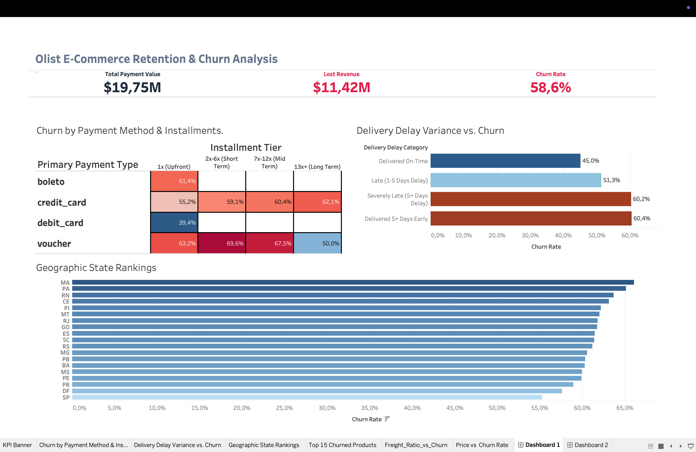
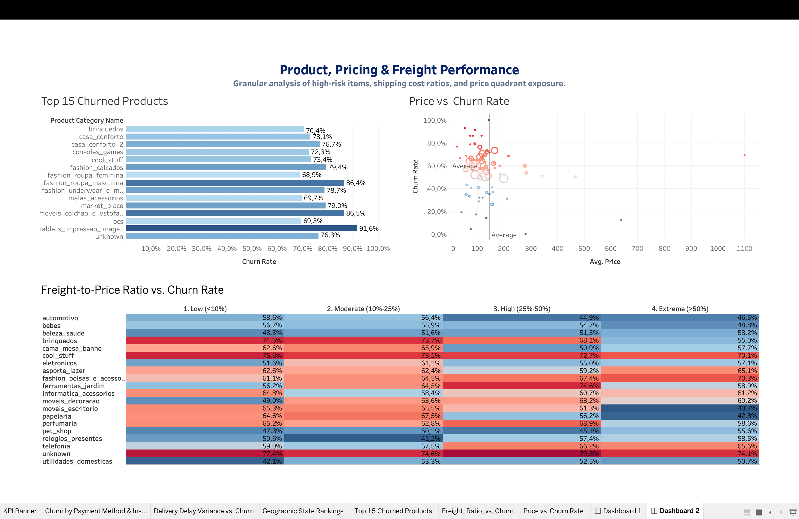

# Olist E-Commerce Retention & Product Performance Analysis

## Table of Contents
- [Executive Summary](#-executive-summary)
- [Data Stack & Engineering Pipeline](#-data-stack--engineering-pipeline)
- [Key Business Insights](#-key-business-insights)
- [Strategic Recommendations](#-strategic-recommendations)
- [Data Access & Download](#-data-access--instructions)


## Executive Summary
This project delivers an end-to-end analytics solution diagnosing customer retention, logistical friction, financial payment mechanics, and SKU pricing dynamics for **Olist**, Brazil's largest marketplace platform. 

Out of **$19.75M in Total Payment Value**, the platform experiences an overall **58.6% churn rate**, resulting in **$11.42M in lost revenue**. By combining Python data engineering, SQL relational modeling, and interactive Tableau dashboards, this analysis isolates root causes across operations and provides actionable intervention strategies to recover lost revenue.

---

## Data Stack & Engineering Pipeline
* **ETL & Data Cleaning:** Python (`pandas`, `numpy`) — Handled missing values, formatted timestamp structures, computed row-level freight ratios, and grouped payment installment tiers.
* **SQL Data Modeling:** PostgreSQL — Built aggregation queries, churn percentage calculations, window functions, and geographic rank metrics.
* **Data Visualization:** Tableau Desktop — Constructed two cross-filtered dashboards utilizing custom volume context filters, quadrant scatter plots, and risk heat maps.

---

## Key Business Insights

### 1. Macro Operational Drivers (Dashboard 1)

* **Financial Payment Friction:** Vouchers and long-term credit installment plans drive elevated churn. Voucher payments reach up to **69.6% churn** in short-term tiers (2–6x), while credit card churn scales continuously from **55.2%** (1x) up to **62.1%** for long-term installments (13+x). Debit cards exhibit the lowest churn at **39.4%**.
* **Logistics & Delivery Delay Thresholds:** On-time deliveries maintain the lowest baseline churn (**45.0%**). Minor delays (1–5 days) increase churn to **51.3%**, while severe delays (5+ days) spike churn to **60.2%**.
* **Geographic Disparities:** High churn is concentrated in northern/northeastern regions (`MA` leading at **~66.0%**, followed by `PA` and `RN`), whereas primary economic hubs like São Paulo (`SP`) maintain the lowest churn rate at **~55.0%**.

### 2. Micro Product & Pricing Dynamics (Dashboard 2)


* **Product Category Volatility:** Categories like `tablets_impressao_imagem` (**91.6% churn**), `moveis_colchao_e_estofados` (**86.5%**), and `fashion_roupa_masculina` (**86.4%**) represent severe churn hotspots.
* **Price Point Sensitivity:** The 4-quadrant scatter plot demonstrates that low-to-mid priced items ($\le \$150$) account for the highest volume of high-churn orders (60%–80% cluster), indicating potential item quality or description mismatches. High-ticket items ($\ge \$1,000$) represent extreme localized revenue risk (69.4% churn at $1,100).
* **Freight Fee Burden:** High shipping costs relative to item price significantly trigger buyer cancellation. Categories like `consoles_games` experience **78.0% churn** when freight exceeds 50% of the item value, compared to 64.8% at moderate freight ratios.

---

## Strategic Recommendations

1. **Optimize High-Installment Checkout:** Introduce fraud prevention and reminder triggers for credit card payments spanning 7+ installments, and audit voucher redemption logic to prevent cart abandonment.
2. **Set Regional Delivery Thresholds:** Partner with local third-party logistics (3PL) fulfillment hubs in high-churn northern states (`MA`, `PA`, `RN`) to reduce transit times below the critical 5-day delay threshold.
3. **Subsidize Heavy Shipping Costs:** Implement capped freight subsidies or bundle shipping fees into listing prices for high-ratio categories (e.g., `consoles_games`, `cool_stuff`) where shipping fees currently exceed 25%–50% of item value.

---

## Dashboard Suite Architecture

* **Dashboard 1 (Executive Summary):** C-suite overview featuring high-level KPIs, Payment & Installment Matrix, Delivery Delay Variance bar chart, and Geographic State Rankings.
* **Dashboard 2 (Product, Pricing & Freight Performance):** Operational drilldown featuring the Top 15 Churned Product Categories, a 4-Quadrant Price vs. Churn Scatter Plot, and a Freight-to-Price Ratio Heat Matrix.

---

## Live Links & Repository Structure
* **Live Tableau Dashboards:** https://public.tableau.com/app/profile/erik.makhmuryan/vizzes
* **SQL Queries:** [`/sql/03_sql_analytics_queries.sql`](./sql)
* **ETL Scripts:** [`/notebooks/01_data_cleaning.ipynb`](./notebooks)

---

## Data Access & Instructions

The raw dataset used in this analysis exceeds GitHub's web file size limits and is excluded from this repository. You can download the original, raw Brazilian E-Commerce Dataset directly from Kaggle:

* **Source Dataset:** [Brazilian E-Commerce Public Dataset by Olist (Kaggle)](https://www.kaggle.com/datasets/olistbr/brazilian-ecommerce)

### How to Replicate Locally:
1. Download the zip file from Kaggle and extract the raw `.csv` files into a local folder named `data/`.
2. Run `notebooks/01_data_cleaning.ipynb` to execute the ETL pipeline and generate the merged analytical dataset (`olist_master_clean.csv`).
3. Load the cleaned dataset into PostgreSQL or Tableau to run the queries and view the workbooks.

```text
├── notebooks/
│   ├── 01_data_cleaning.ipynb
│   └── 02_exploratory_data_analysis.ipynb
├── sql/
│   └── 03_sql_analytics_queries.sql
├── vizualization/
│   ├── Executive_Summary.png
│   ├── Product_Performance.png
│   └── vizualization.twb
└── README.md
